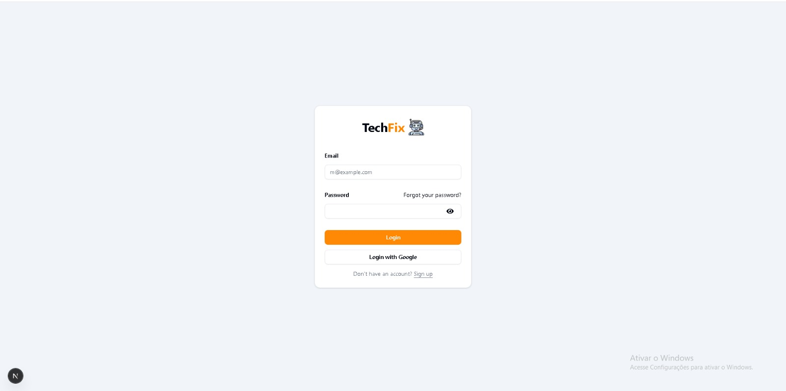
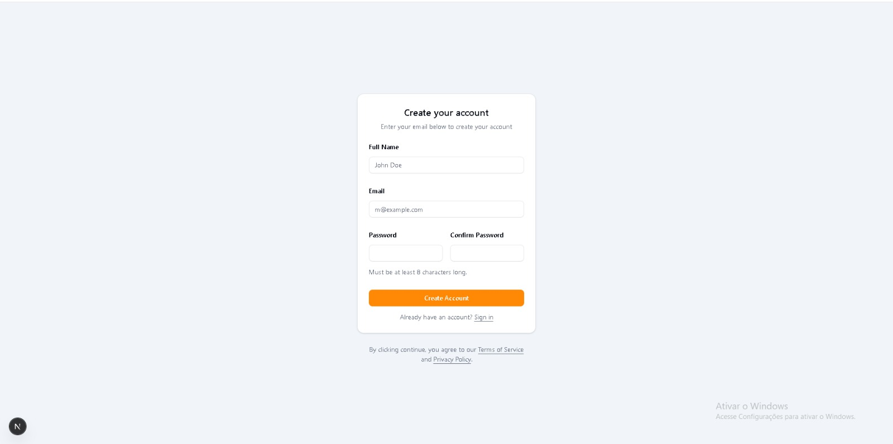
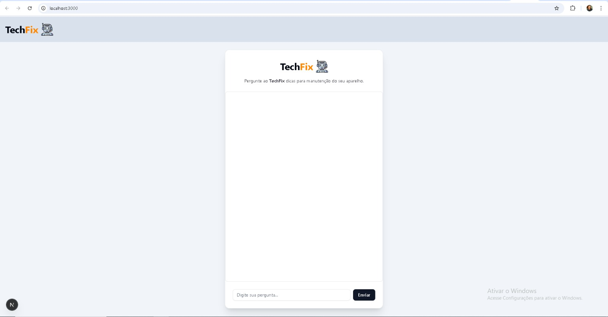

# 🤖 Chatbot Fullstack (Node.js + Next.js + React)

Este projeto é um **chatbot fullstack** desenvolvido com **Node.js no backend** e **Next.js/React no frontend**, com sistema de **autenticação (Sign In / Sign Up)** e integração com a **API do Google Gemini** para respostas inteligentes.

> 🚀 Projeto em desenvolvimento — já funcional e evoluindo continuamente, com foco em portfólio para vagas de **estágio / júnior em desenvolvimento web**.

---

## 📸 Demonstração

> As imagens abaixo mostram o funcionamento atual do projeto.

### 🔐 Tela de Login



### 📝 Tela de Cadastro



### 💬 Chatbot em Funcionamento



---

## 🧠 Funcionalidades

* ✅ Interface moderna com React + Next.js
* ✅ Backend em Node.js
* ✅ Integração com a API do **Google Gemini**
* ✅ Chat em tempo real (requisição/resposta)
* 🚧 Validações completas no backend (em andamento)
* 🚧 Persistência de dados e melhorias de segurança
* 🚧 Validações completas no backend e frontend do login e cadastro de usuários


---

## 🛠️ Tecnologias Utilizadas

### Frontend

* Next.js
* React
* TypeScript
* CSS / Tailwind (se aplicável)

### Backend

* Node.js
* Express
* API Google Gemini
* JWT (planejado / em implementação)

---

## 📂 Estrutura do Projeto (Simplificada)

```
chatbot-project/
├── backend/
│   ├── src/
|   ├── agent/
|   ├── controllers/
|   ├── prompts/    
|   
│   ├── routes/
|   ├── services/
|   ├── server.js/
│       
│   
│
├── frontend/
│   ├── app/
│   ├── components/
│   
│
├── images/
│   ├── login.png
│   ├── signup.png
│   └── chat.png
│
└── README.md
```

---

## ⚙️ Como Rodar o Projeto

### 🔹 Backend

```bash
cd backend
npm install
npm run dev
```

### 🔹 Frontend

```bash
cd frontend
npm install
npm run dev
```

> Certifique-se de configurar corretamente as **variáveis de ambiente**, incluindo a chave da API do Gemini.

---

## 🔑 Variáveis de Ambiente (Exemplo)

```env
GEMINI_API_KEY=sua_chave_aqui
```

---

## 🎯 Objetivo do Projeto

Este projeto foi criado com o objetivo de:

* Consolidar conhecimentos em **fullstack JavaScript**
* Praticar integração com **APIs de IA**
* Servir como **projeto de portfólio** para processos seletivos
* Demonstrar organização, boas práticas e evolução contínua

---

## 🚀 Próximos Passos

* Implementar validações completas no backend
* Persistência de usuários e histórico de mensagens
* Proteção de rotas
* Melhorias de UX/UI
* Deploy do projeto
* Implementar Autenticação JWT

---

## 👨‍💻 Autor

**Gabriel Honorio**
Desenvolvedor Web | Estudante de ADS

* GitHub: [https://github.com/Gabrielhz1](https://github.com/Gabrielhz1)
* LinkedIn: [https://www.linkedin.com/in/gabriel-honorio-2159ab266/](https://www.linkedin.com/in/gabriel-honorio-2159ab266/)

---

⭐ Se você é recrutador(a) ou dev e chegou até aqui, fique à vontade para explorar o projeto!
